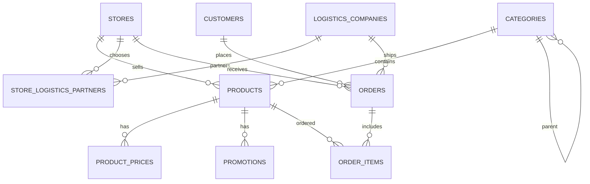

# HomeMart - Bai thuc hanh so 4

Ung dung web demo cho san thuong mai ban do gia dung, tap trung module Ban + Mua hang:

- Admin quan ly danh muc hang gia dung.
- Admin quan ly thong tin hang ban.
- Admin them lich su gia ban va khuyen mai.
- User xem trang web ban hang, loc san pham, them gio hang va dat hang.
- Backend co API ket noi lop du lieu va schema T-SQL de tao CSDL tren SQL Server.

## Cach chay

Yeu cau: Node.js va SQL Server.

Chay file `source/backend/db/schema.sql` trong SQL Server Management Studio de tao database `HomeMartDb`, cac bang va du lieu mau.

### Cấu hình bằng file .env (Khuyên dùng)
Tạo file `.env` ở thư mục gốc hoặc thư mục `source/backend/` và cấu hình các biến như sau:

```env
# Cấu hình SQL Server
SQL_SERVER=localhost\SQLEXPRESS
SQL_DATABASE=HomeMartDb
SQL_TRUSTED=true
SQL_DRIVER=ODBC Driver 17 for SQL Server

# API Keys cho AI Chatbot
GROQ_API_KEY=your_groq_api_key_here
GEMINI_API_KEY=
```

Sau đó khởi động ứng dụng:
```bash
cd source/backend
npm.cmd start
```

### Cấu hình bằng biến môi trường thủ công

Neu dung SQL Server Authentication:

```powershell
$env:SQL_SERVER='localhost\SQLEXPRESS'
$env:SQL_DATABASE='HomeMartDb'
$env:SQL_USER='sa'
$env:SQL_PASSWORD='mat_khau_sql_server'
cd source/backend
npm.cmd start
```

Neu dung Windows Authentication:

```powershell
$env:SQL_SERVER='localhost\SQLEXPRESS'
$env:SQL_DATABASE='HomeMartDb'
$env:SQL_TRUSTED='true'
$env:SQL_DRIVER='ODBC Driver 17 for SQL Server'
$env:GROQ_API_KEY='your-groq-api-key'
cd source/backend
npm.cmd start
```

Mo trinh duyet:

- Trang user: `http://localhost:3000`
- Trang admin: `http://localhost:3000/admin.html`

Tai khoan admin mac dinh:

- Username: `admin`
- Password: `admin123`

## CSDL

File schema SQL Server: `source/backend/db/schema.sql`

Thiet ke co cac bang chinh:

- `stores`: cua hang ban hang.
- `logistics_companies`: cong ty giao nhan.
- `store_logistics_partners`: lien ket cua hang voi don vi giao nhan, co phi va khu vuc phuc vu.
- `categories`: danh muc san pham, co `slug`, `seo_title`, `seo_description` phuc vu SEO.
- `products`: hang gia dung, co SKU, ton kho, mo ta, anh, slug va thong tin SEO.
- `product_prices`: lich su gia ban theo thoi gian.
- `promotions`: khuyen mai theo san pham.
- `customers`, `orders`, `order_items`: phan mua hang va don hang.

## ERD dang van ban



## API chinh

- `GET /api/summary`
- `POST /api/auth/login`
- `POST /api/auth/logout`
- `GET /api/categories`
- `POST /api/categories`
- `PUT /api/categories/:id`
- `DELETE /api/categories/:id`
- `GET /api/products`
- `POST /api/products`
- `PUT /api/products/:id`
- `DELETE /api/products/:id`
- `POST /api/prices`
- `GET /api/promotions`
- `POST /api/promotions`
- `PUT /api/promotions/:id`
- `DELETE /api/promotions/:id`
- `GET /api/logistics-companies`
- `POST /api/orders`
- `GET /api/admin/orders`
- `PUT /api/admin/orders/:id`
- `GET /api/admin/logistics-companies`
- `POST /api/admin/logistics-companies`
- `PUT /api/admin/logistics-companies/:id`
- `DELETE /api/admin/logistics-companies/:id`
- `GET /api/admin/store-logistics-partners`
- `POST /api/admin/store-logistics-partners`
- `PUT /api/admin/store-logistics-partners/:id`
- `DELETE /api/admin/store-logistics-partners/:id`
- `GET /api/admin/reports/overview`
- `GET /api/admin/reports/revenue-by-date`
- `GET /api/admin/reports/top-products`
- `GET /api/admin/reports/revenue-by-category`
- `GET /api/admin/reports/order-status-summary`
- `POST /api/chatbot`

